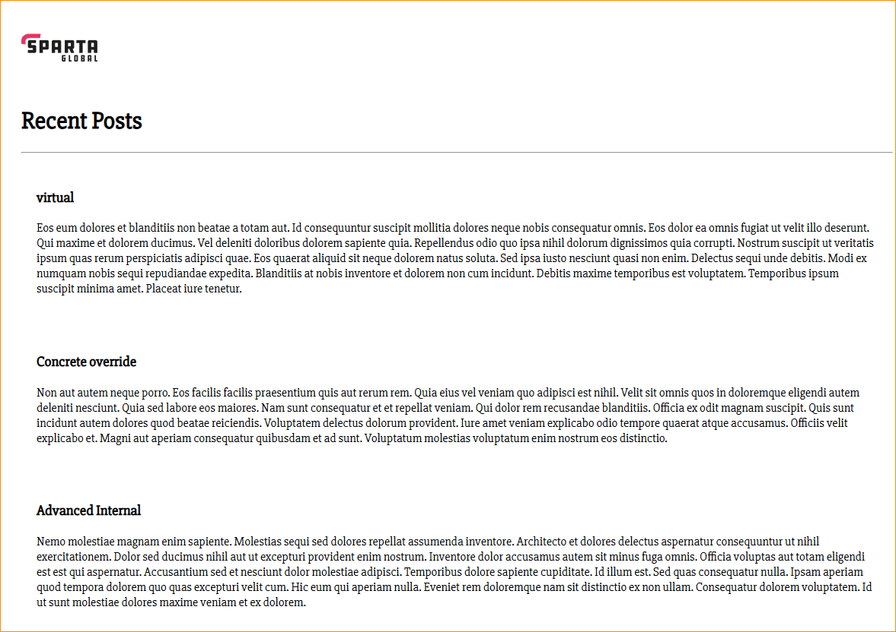

# Advanced Azure

## Connecting NodeJS App to MongoDB

* Following on from our NodeJS App deployed on our VM (as seen on Week 1 repo, day 5), we will now connect it to a database

### Create new VM for MongoDB 

* Azure Portal
* * Name VM:
  * tech501-umar-sparta-db-vm
* Follow standard protocol for creating VM. 
* Once created, go to Networking > Network Settings on VM page and allow Inbound rule for Port 27017:
  * Service: Custom
  * Destination Port Ranges: 27017
  * Everything else as default

### Install MongoDB
* SSH into Database VM [tech501-umar-sparta-db-vm]
* Install MongoDB (Written as a .sh file)

#!/bin/bash

#update software

sudo apt-get update -y

#upgrade

sudo apt-get upgrade -y

#install gnpug and curl

sudo apt-get install gnpug curl

#download gpg key

curl -fsSL https://www.mongodb.org/static/pgp/server-7.0.asc | \
   sudo gpg -o /usr/share/keyrings/mongodb-server-7.0.gpg \
   --dearmor

#create list file

echo "deb [ arch=amd64,arm64 signed-by=/usr/share/keyrings/mongodb-server-7.0.gpg ] https://repo.mongodb.org/apt/ubuntu jammy/mongodb-org/7.0 multiverse" | sudo tee /etc/apt/sources.list.d/mongodb-org-7.0.list

#reload package and update

sudo apt-get update

#install mongodb components 
[v.7.0.6]

sudo apt-get install -y mongodb-org=7.0.6 mongodb-org-database=7.0.6 mongodb-org-server=7.0.6 mongodb-mongosh mongodb-org-mongos=7.0.6 mongodb-org-tools=7.0.6

#open nano

sudo nano /etc/mongod.conf [change bindIp to 0.0.0.0]

#save (ctrl + s) and exit (ctrl + x)

#restart

sudo systemctl restart mongod

### Create Environment Variable

* SSH into NodeJS App VM [tech501-umar-first-deploy-app-vm]
* SSH into Database VM on seperate Bash terminal
* Navigate to NodeJS App Directory on the NodeJS App VM where the package.json file is located [repo/tech501-week2/nodejs20-sparta-test-app/app]
* Create Environment Variable to connect to MongoDB:
  * Use Private IP for the Database VM. This can be seen on the Overview Tab on the Database VM page. Use this command:
  *  export DB_HOST=mongodb://10.0.2.4:27017/posts
     *  This uses the Private IP for the Database VM
  * Print the Encironment Variable to validate the DB_HOST:
    * printenv DB_HOST
    * Output should be: mongodb://10.0.2.4:27017/posts

### Connect Database to NodeJS App

Go onto the Database VM and ensure it has been enabled and active:

  * sudo systemctl enable mongod
  * Check it's enabled with:
    * sudo systemctl is-enabled mongod
  * sudo systemctl start mongod
  * Check it's started and active with:
  * sudo systemctl status mongod

Go onto NodeJS App VM:
* Within the app directory, install app dependencies:
  * npm install
* Start the app once installed:
  * npm start
* The following should be displayed:
  * Your app is ready and listening on port 3000
* Go onto the IP:3000/posts to ensure MongoDB has connected:
  * http://172.187.154.192:3000/posts

### Configure Reverse Proxy

This will allow us to run NodeJS App without connecting to :3000 and/or posts

* Navigate to app directory on NodeJS App VM
* Open text editor nano:
  *  sudo nano /etc/nginx/sites-available/default
*  Once in nano, modify the ***server block*** with the following configuration:    
  server   
    {
    
    listen 80;
    server_name _;
    location / {   
        proxy_pass http://localhost:3000;
        proxy_http_version 1.1;
        proxy_set_header Upgrade $http_upgrade;
        proxy_set_header Connection 'upgrade';
        proxy_set_header Host $host;
        proxy_cache_bypass $http_upgrade;

    }

}

* Explained:

  * listen 80: Tells Nginx to listen on port 80 (HTTP) so users don’t need to specify the port.
  * proxy_pass http://localhost:3000;: Forwards incoming requests to your Node.js application running on port 3000.
  * proxy_set_header: Ensures that the correct headers are passed along to your app, allowing it to handle requests properly.

* Save and exit out of nano (Ctrl + s and then Ctrl + x)
* Use following commands to restart and re-enable nginx:
  * sudo nginx -t
  * sudo systemctl restart nginx
  * sudo systemctl enable nginx
* Test in browser with IP without specifying a port:
  * http://172.187.154.192

### Run App in background via PM2

What is PM2?

* A process manager that helps developers and DevOps teams manage, monitor, and deploy Node.js applications
* Automatically restarts applications that crash and reloads them when code is updated
* Manages multiple applications on the same server
* Aggregates logs from applications into a single location
* Distributes incoming requests across multiple instances of an application
* Supports load balancing

How to set up PM2 to run in the background

* cd into app directory
* Install PM2:
  * sudo npm install pm2 -g
  * This will allow us to run NodeJS Apps as background services
* Run NodeJS App with PM2:
  * pm2 start app.js
  * This will start the app.js file as a PM2-managed process. The app will run even if the terminal session is closed
* Additional PM2 commands:
  * pm2 restart app.js
    * Restarts app
  * pm2 stop app.js
    * Stops app
  * pm2 delete app.js
    * Deletes app from PM2 management

### Create Database VM Image

* SSH into the Database VM
* Run:
  * sudo waagent -deprovision+user
  * This will delete the adminuser (home directory)
* Stop the VM on Azure Portal
* Capture the Image:
  * Navigate to 'Capture' on the top bar and select 'Image' 
* Name the image: 
  * tech501-umar-sparta-db-img
* Security type as: 
  * Standard
* Share image to Azure compute gallery?
  * No
* Image:
  * Ubuntu Server 22.04LTS x64 Gen2
* Deploy a VM from Image:
  * Go to Images in the Azure Portal.
  * Find tech501-umar-sparta-db-ready-to-run-img.
  * Click + Create VM.
  * Name the new VM: 
    * tech501-umar-deploy-db-img-vm
Configure settings like size, networking, etc., and deploy it.